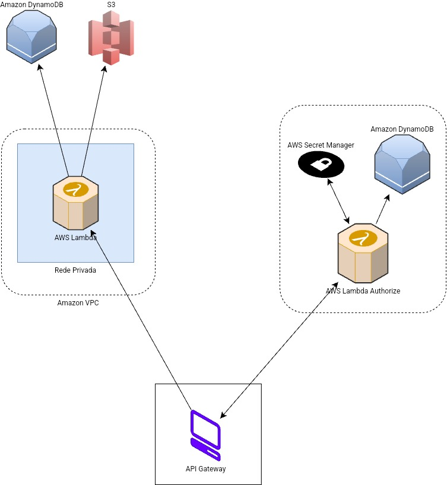

# Desafio 01 - Gerenciando Instâncias EC2 na AWS

O Amazon EC2 (Elastic Compute Cloud) é um serviço de computação em nuvem que permite criar e gerenciar servidores virtuais — chamados de instâncias — na infraestrutura da AWS. O gerenciamento dessas instâncias envolve várias etapas e ferramentas que garantem flexibilidade, escalabilidade e controle total sobre os recursos computacionais.

## Principais Atividades de Gerenciamento

- Criação e Configuração:
  - Escolha do tipo de instância (CPU, memória, armazenamento, rede).
  - Seleção do sistema operacional (Linux, Windows, etc.).
  - Definição de regras de segurança (grupos de segurança, chaves SSH).

- Monitoramento e Manutenção:
  - Uso do Amazon CloudWatch para monitorar métricas como uso de CPU, disco e rede.
  - Aplicação de atualizações e patches no sistema operacional.

- Automatização:
  - Ferramentas como o AWS Systems Manager permitem automatizar tarefas rotineiras, como execução de comandos, gerenciamento de patches e inventário de software.

- Escalabilidade e Elasticidade:
  - Implementação de Auto Scaling para ajustar automaticamente o número de instâncias com base na demanda.
  - Uso de Elastic Load Balancing para distribuir o tráfego entre instâncias.

- Encerramento e Otimização de Custos:
  - Encerramento de instâncias não utilizadas.
  - Uso de instâncias reservadas ou spot para reduzir custos.

## Desafio Instâncias EC2

Arquitetura de escala para Banking as a Service (BaaS)

 
### Fontes

- [Instâncias do Amazon EC2](https://docs.aws.amazon.com/pt_br/AWSEC2/latest/UserGuide/Instances.html)
- [Criando uma arquitetura de escala para Banking as a Service (BaaS)](https://aws.amazon.com/pt/blogs/aws-brasil/criando-uma-arquitetura-de-escala-para-banking-as-a-service-baas/)

